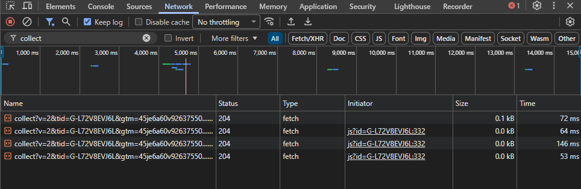
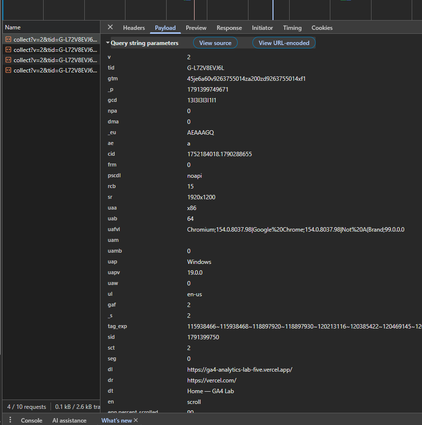

# Домашняя работа № 1 · Путь данных от ссылки до заявки

**Дисциплина:** ОП.03 «Информационные технологии»

| Поле | Значение |
|---|---|
| Фамилия, имя, отчество | Кошина Александра Олеговна |
| Группа | 9/2-РПО-25/3 |
| Номер работы | 1 |
| Тема работы | Цифровая воронка: путь данных от ссылки до заявки |
| Ветка | `hw-01` |

---

## Задание

1. Открыть сайт, панель разработчика (F12) → **Network**, в фильтре `collect`,
   галочка **Preserve log**.
2. Сделать три действия: обновить страницу, прокрутить до низа, нажать
   на товар. Записать, какие события ушли — параметр `en` на вкладке **Payload**.
3. Описать путь пользователя от ссылки до заявки, пять шагов.
4. Найти одно место на этом пути, где данные могут потеряться.
5. Приложить скриншоты `screens/01-network.png` и `screens/02-payload.png`.

Сайт: https://shop.merch.google/, запасные — https://habr.com/ru/,
https://www.smashingmagazine.com/, https://css-tricks.com/. Открывать
в Chrome или Edge с выключенным блокировщиком рекламы.

Срок — до начала занятия 2. Ветка `hw-01`, запрос на слияние в свою `main`.

---

## 1. Какой сайт смотрел

| Поле | Значение |
|---|---|
| Название сайта | GA4 Lab |
| Адрес | https://ga4-analytics-lab-five.vercel.app/index.html |
| Откуда сайт | свой |

## 2. Три действия и что отправил счётчик

Панель Network, фильтр `collect`, галочка Preserve log. Название события
лежит в параметре `en` на вкладке Payload.

| № | Что я сделал на сайте | Название события (`en`) | Что ещё было в Payload |
|---|---|---|---|
| 1 | перешла на другую страницу | page_view | в dl была ссылка на новою страницу |
| 2 | прокрутил до низа | scroll | в epn.percent_scrolled можно увидеть часть сайта, которая была просмотрена (в %) |
| 3 | начала заполнять форму | form_start | в ep.form_destination можно увидеть куда уходит заполенная форма |

Скриншоты:

## 3. Путь пользователя: 5 шагов

От ссылки до заявки, своими словами. Панель для этого не нужна: это рассказ
о том, как человек доходит до кнопки «Отправить». В правом столбце стоит
пример, в левом вы пишете свой вариант.

| № | Мой шаг | Пример |
|---|---|---|
| 1 | Человеку попалась реклама в соц сети и перешел по ней | *человек увидел ссылку в сообществе и нажал на неё* |
| 2 | Загрузился лендинг сайта | *открылась главная страница сайта* |
| 3 | Человек проскролил через контент до формы | *он прокрутил до формы записи* |
| 4 | Ввел свои контактные данные | *начал заполнять: имя и телефон* |
| 5 | Отправил заявку и ожидает ответа | *нажал «Отправить», заявка ушла менеджеру* |

## 4. Где данные могут потеряться

| № | На каком шаге | Что может потеряться |
|---|---|---|
| 1 | шаг 4, заполнение формы | слишком много полей для заполнения, клиент уходит |

## 5. Использование ИИ

| Вопрос | Ответ |
|---|---|
| Что сделал сам | Все сама. |
| Что спросил у модели |  |
| Что после этого изменил |  |
