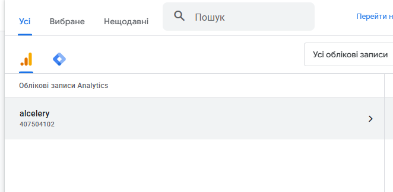
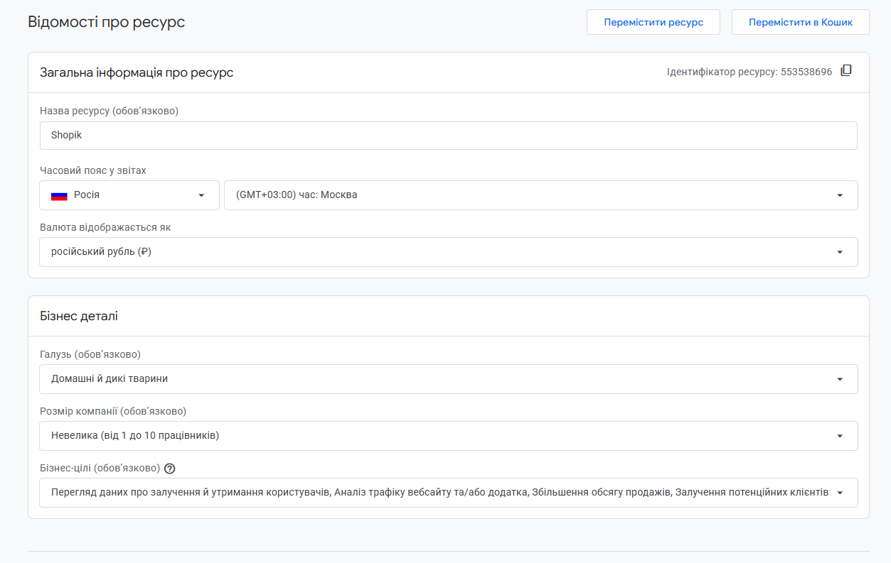
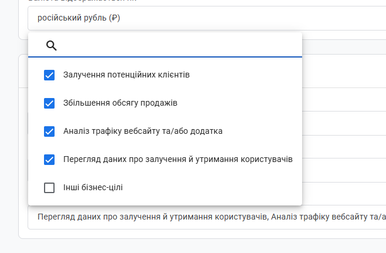
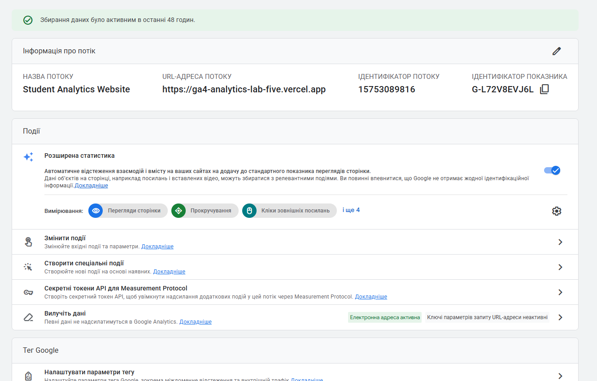
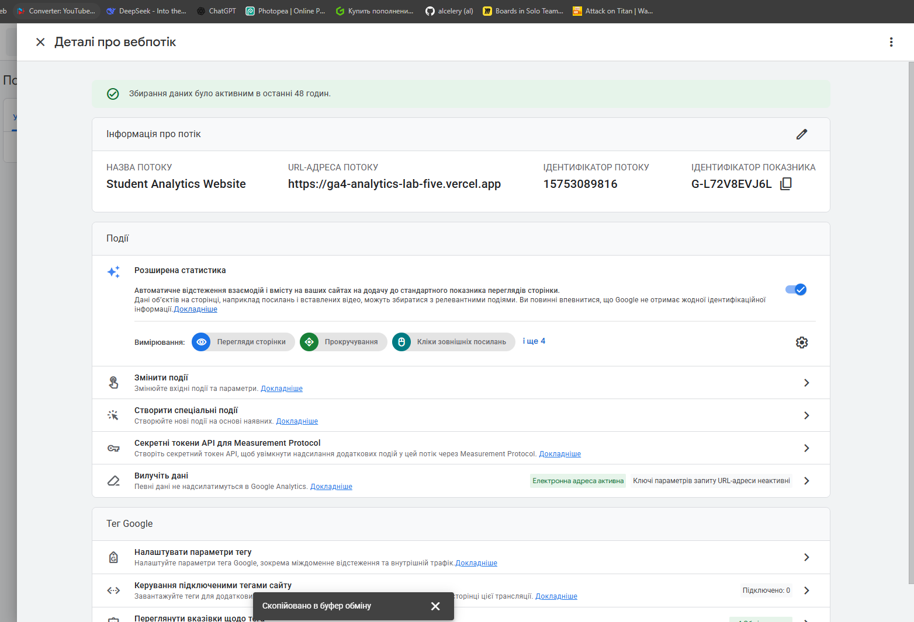

# Домашняя работа № 2 · Где бизнес теряет клиентов

**Дисциплина:** ОП.03 «Информационные технологии»

| Поле | Значение |
|---|---|
| Фамилия, имя, отчество | Кошина Александра Олеговна |
| Группа | 9/2-РПО-25/3 |
| Номер работы | 2 |
| Тема работы | Анализ воронки цифрового продукта и структура Google Analytics 4 |
| Ветка | `hw-02` |

---

# Часть 1. Исследование воронки

## 1.1. Объект исследования

| Поле | Значение |
|---|---|
| Компания, сервис или отрасль | "Умскул" — российская онлайн-школа |
| Адрес сайта или приложения | https://umschool.net/ |
| Целевое действие | Покупка курса |
| Почему выбран этот объект | Есть проверяемые кейсы с цифрами по конверсии на всех этапах воронки, полный цифровой путь клиента и достаточно открытых источников для анализа. |

## 1.2. Воронка

От 4 до 7 этапов, по порядку.

| № | Этап | Что считается переходом дальше | Метрика этапа |
|---|---|---|---|
| 1 | Показ и клик по рекламе | Пользователь кликнул по объявлению в соцсетях | CTR, CPC |
| 2 | Переход на сайт и взаимодействие с лид-ботом | Ответил на первый вопрос бота | Конверсия в диалог |
| 3 | Лид-бот и оставление контактов | Ввёл номер телефона | Конверсия в телефон |
| 4 | Заявка и квалификация менеджером | Лид признан целевым | Конверсия в целевой лид |
| 5 | Оплата курса | Внёс оплату за основной курс | Конверсия из лида в оплату |
| 6 | Удержание | Продлил обучение или купил второй курс | Коэффициент удержания |

## 1.3. Источники

Не менее пяти. Каждый разбирается по пяти пунктам.

### Источник 1

| Поле | Значение |
|---|---|
| Название материала | Кейс Умскул: поп-апы и лид-боты приносят 50% выручки с сайта |
| Автор или организация | Carrot quest |
| Дата публикации | 26 июля 2024 |
| Прямая ссылка | https://www.carrotquest.io/blog/case-umschool/ |

**Выписка из материала** (ключевая мысль, цифра, наблюдение, результат):

```
До внедрения Carrot quest конверсия была 0,2% из посещения в заявку. Конверсия из лида в целевого лида — 77%. ... Carrot quest в 2,5 раза увеличил конверсию сайта в заявку из посещения. ... +12,5% оплат с сайта дополнительно принес поп-ап по брошенной корзине.
```

**Что подтверждает и как связано с моей воронкой** (своими словами):

```
Источник подтверждает, что основной рост конверсии достигается не из-за привлечения нового трафика, а из-за работы с пользователями на разных этапах воронки. Кейс напрямую обосновывает этапы 2–5 воронки, а именно взаимодействие с лид-ботом, оставление контактов, квалификация и оплата.
```

**Цифры из источника и этап воронки, к которому относятся:**

```
0,2% — конверсия из посещения в заявку до внедрения (этап 2 в этап 3)
77% — конверсия из лида в целевого лида до внедрения (этап 4)
4% — конверсия из посещения во взаимодействие с инструментами за 2 недели теста (этап 2)
+50% — рост общего количества заявок с сайта без дополнительного трафика (этап 3)
5,85% — конверсия из прочтения поп-апа в номер телефона (этап 3)
+12,5% — дополнительных оплат с сайта от поп-апа по брошенной корзине (этап 5)
24% — конверсия в телефон из начала диалога с лид-ботом (этап 3)
16% — целевых лидов от общего количества собрал поп-ап с лид-магнитом (этап 3)
50% — доля выручки с сайта от инструментов Carrot quest (этап 5)
ROMI 1453% — окупаемость подписки за 2 месяца (этап 5)
```

### Источник 2

| Поле | Значение |
|---|---|
| Название материала | В 7 раз увеличиваем ROI, продвигая рассылку: кейс Умскул |
| Автор или организация | VK Реклама |
| Дата публикации | 8 августа 2024 |
| Прямая ссылка | https://ads.vk.ru/cases/uvelichivaem-roi-rassylki-kejs-umskul |

**Выписка из материала:**

```
За месяц команда "Умскул" получила 1400 подписок на рассылку чат-бота, при этом стоимость целевого действия снизилась на 33% относительно результатов прошлых размещений в старом кабинете ВКонтакте. Помимо подписок пользователи активно покупали курсы для подготовки к ОГЭ и ЕГЭ: по итогам кампании возврат инвестиций в продвижение вырос в семь раз относительно предыдущего промо.
```

**Что подтверждает и как связано с моей воронкой:**

```
Источник показывает, как ретаргетинг по разным сегментам аудитории позволяет возвращать пользователей, которые уже контактировали с продуктом, но не совершили покупку. Это относится к этапу 6 воронки, а именно удержанию и возврату пользователей.
```

**Цифры из источника и этап воронки:**

```
1400+ подписок на рассылку за месяц (этап 3)
33% — снижение стоимости целевого действия (этап 3)
7x — рост возврата инвестиций в продвижение (этап 6)
```

### Источник 3

| Поле | Значение |
|---|---|
| Название материала | Воронки — отчёт для аналитики пользовательских сценариев |
| Автор или организация | Яндекс |
| Дата публикации | Актуальная версия |
| Прямая ссылка | https://yandex.ru/support/metrica/ru/reports/funnels.html |

**Выписка из материала:**

```
Воронка — отчет, который показывает, как пользователи проходят заданный набор шагов за определенное время. С помощью отчета Воронка вы можете: оценить эффективность пути пользователей от первого до последнего шага; проанализировать поведение посетителей на разных этапах; определить, в каких срезах существуют проблемы с эффективностью
```

**Что подтверждает и как связано с моей воронкой:**

```
Это основа для построения воронки. Источник объясняет, как технически фиксировать переходы между этапами, какие условия можно использовать. Обосновывает выбор метрик для каждого этапа воронки.
```

**Цифры из источника и этап воронки:**

```
Максимальный период для воронки — 360 дней (все этапы)
В одном шаге можно использовать до трёх условий (все этапы)
```

### Источник 4

| Поле | Значение |
|---|---|
| Название материала | Составная цель — последовательность шагов в рамках одного визита |
| Автор или организация | Яндекс |
| Дата публикации | Актуальная версия |
| Прямая ссылка | https://yandex.ru/support/metrica/ru/general/goal-steps |

**Выписка из материала:**

```
Цель может состоять максимум из пяти шагов. В один шаг можно добавить до 10 условий. Выбирайте цепочку шагов так, чтобы каждый следующий шаг был невозможен без выполнения предыдущего. Посетитель должен совершить шаги только в той последовательности, которая указана в настройках цели
```

**Что подтверждает и как связано с моей воронкой:**

```
Показывает, как описать воронку через последовательность условий. Это нужно для того, чтобы этапы были логически связаны. Обосновывает логику построения этапов 1–5.
```

**Цифры из источника и этап воронки:**

```
Максимум 5 шагов в составной цели (все этапы)
До 10 условий в одном шаге (все этапы)
Шаги должны быть выполнены в рамках одного визита (все этапы)
```

### Источник 5

| Поле | Значение |
|---|---|
| Название материала | Сегментация по шагам составной цели: анализируйте, как посетители продвигаются к конверсии |
| Автор или организация | Яндекс |
| Дата публикации | 13 марта 2017 |
| Прямая ссылка | https://b2b.yandex.ru/adv/news/segmentatsiya-po-shagam-sostavnoy-tseli-analiziruyte-kak-posetiteli-prodvigayutsya-k-konversii |

**Выписка из материала:**

```
Теперь в Метрике можно создавать сегменты по шагам составной цели. Это позволит изучать визиты, в которых посетители прошли путь до конверсии не полностью — например, добавили товар в корзину, указали условия доставки, но так и не добрались до страницы заказа
```

**Что подтверждает и как связано с моей воронкой:**

```
Показывает, как находить потери на этапах. Связано с этапами 4–5 моей воронки, а именно послание заявки, после появление целевого лида, а после оплата.
```

**Цифры из источника и этап воронки:**

```
Источник не содержит числовых метрик
```

## 1.4. Реальные кейсы

Не менее двух, российские компании или российский рынок. Каждый разбирается по семи
пунктам. Если показатели не опубликованы, пишется: «точные показатели
в открытом источнике не приведены».

### Кейс 1

| № | Пункт | Ответ |
|---|---|---|
| 1 | Компания, продукт или рынок | "Умскул" — российская онлайн-школа |
| 2 | Как выглядела воронка или её проблемный участок |Воронка пошла бы примерно так: Посещение сайта, заявка через статичную лид-форму, квалификация менеджером, оплата. Проблемный участок — это конверсия из посещения в заявку (0,2%) |
| 3 | В чём заключалась проблема | 	На сайте стояли лид-формы, которые собирали имя и телефон. Менеджеры не получали данных о лиде до первого контакта и не могли быстро подобрать предложение. Пользователи уходили, не оставив заявку |
| 4 | Какие данные или наблюдения подтвердили проблему | Конверсия из посещения в заявку — 0,2% , а конверсия из лида в целевого лида — 77%. То есть проблема не в качестве лидов, а в их количестве |
| 5 | Что изменили или протестировали | Внедрили лид-боты с квалифицирующими вопросами, поп-апы, онлайн-чат, интеграцию с amoCRM |
| 6 | Как изменился результат | Конверсия из посещения в заявку выросла в 2,5 раза. Общее количество заявок с сайта +50% без дополнительного трафика. Также +12,5% оплат от поп-апа по брошенной корзине. 24% конверсия в телефон из диалога с лид-ботом|
| 7 | Переносим ли подход на мой объект | Да. Для проекта подход полностью переносим, так как это тот же объект исследования |

**Ссылка на источник кейса:**

>https://www.carrotquest.io/blog/case-umschool/

### Кейс 2

| № | Пункт | Ответ |
|---|---|---|
| 1 | Компания, продукт или рынок | "Умскул" — российская онлайн-школа |
| 2 | Как выглядела воронка или её проблемный участок | Воронка  такая: Показ рекламы в VK, переход в мини-приложение, подписка на рассылку чат-бота, покупка курса. Проблемный участок — это возврат пользователей, которые уже контактировали с продуктом, но не купили |
| 3 | В чём заключалась проблема | Компания впервые продвигала акцию три курса по цене двух в мини-приложении ВКонтакте. Нужно было оценить, какие сегменты аудитории дают наибольший возврат инвестиций |
| 4 | Какие данные или наблюдения подтвердили проблему | Точные показатели до в открытом источнике не приведены. Известно, что в старом кабинете ВКонтакте стоимость целевого действия была выше |
| 5 | Что изменили или протестировали | Запустили кампанию из 6 групп объявлений с разными целями, а именно ретаргетинг по CRM-базе, по ключевой фразе "Умскул", на посетителей сайта, на посетителей лендинга, на подписчиков сообщества, на пользователей чат-бота |
| 6 | Как изменился результат | За месяц 1400+ подписок на рассылку. Стоимость целевого действия снизилась на 33% относительно старого кабинета. Возврат инвестиций в продвижение вырос в 7 раз |
| 7 | Переносим ли подход на мой объект | Да. Подход с сегментацией аудитории по разным источникам контакта. |

**Ссылка на источник кейса:**

>https://ads.vk.ru/cases/uvelichivaem-roi-rassylki-kejs-umskul

## 1.5. Причины потери пользователей

Не менее трёх. Каждая опирается на найденные материалы.

| № | Этап воронки | Причина потери | Какой источник это подтверждает |
|---|---|---|---|
| 1 | Этап 2–3 | На сайте стояли только статичные лид-формы, собирающие мало данных. Пользователи не взаимодействовали с ними, потому что форма не помогала подобрать продукт и не отвечала на вопросы | Источник 1. Конверсия из посещения в заявку была всего 0,2%, на сайте были только статичные лид-формы |
| 2 | Этап 3 | Пользователи уходили с сайта без заявок, потому что их ничто не удерживало и не мотивировало оставить контакты. Не было механик на уход | Источник 1: поп-ап с лид-магнитом на попытку ухода собрал 16% целевых лидов; конверсия в телефон из прочтения — 5,3% |
| 3 | Этап 6 | Пользователи, контактировавшие с продуктом, не возвращались для повторной покупки, потому что с ними не работали через ретаргетинг | Источник 2: ретаргетинг по CRM-базе, посетителям сайта и подписчикам сообщества дал 1400+ подписок и рост ROI в 7 раз |

## 1.6. Гипотезы улучшения

Не менее трёх, собственные.

| № | Этап | Гипотеза | Какие данные нужно собрать | Как проверить, сработало |
|---|---|---|---|---|
| 1 | Этап 2–3 | Если добавить лид-бот с квалифицирующими вопросами на верхнеуровневые страницы сайта, конверсия в телефон вырастет | Текущая конверсия из посещения в заявку. Страницы, с которых уходят пользователи. Среднее время на странице. Ответы пользователей в диалоге с ботом | Тест на 2 недели. Сравнить конверсию в оставленный телефон и долю целевых лидов. Успех — это рост конверсии в телефон на 15%+ |
| 2 | Этап 3 | Если показывать поп-ап с бесплатным курсом или гайдом на попытку ухода с сайта, конверсия в заявку | Процент отказов. Страницы с наибольшим уходом. Время до ухода. Текущая конверсия в телефон. Доля целевых лидов | Тест на 2 недели. Сравнить общее количество заявок и долю целевых лидов. Успех — это рост заявок без падения конверсии из лида в целевого |
| 3 | Этап 5 | Если отправлять автоматическое напоминание в мессенджере через 1 час после брошенной корзины, конверсия из заявки в оплату вырастет | Процент незавершённых заявок. Время между началом оформления и уходом. Наличие контактов для связи. Текущая конверсия из лида в продажу | Сегмент пользователей, начавших оформление, но не оплативших. Через 1 час — сообщение с напоминанием. Сравнить с контрольной группой без напоминания. Успех — рост доли завершённых оплат на 10%+ |

---

# Часть 2. Google Analytics 4

## 2.1. Пройденные шаги

| № | Шаг | Выполнено |
|---|---|---|
| 1 | Вход в Google Analytics под своим аккаунтом | да |
| 2 | Создан Analytics Account | да |
| 3 | Создан Property | да |
| 4 | Выбраны часовой пояс, валюта и общие сведения | да |
| 5 | Выбраны бизнес-цели | да |
| 6 | Создан ресурс | да |
| 7 | Создан Web Data Stream | да |
| 8 | Проверены Website URL, Stream name, Enhanced Measurement | да |
| 9 | Поток создан | да 8|
| 10 | Найден Measurement ID | да |

## 2.2. Что получилось

| Поле | Значение |
|---|---|
| Analytics Account | 407504102 |
| Property | 553538696 |
| Reporting time zone | GTM + 03:00 |
| Currency | RUB |
| Выбранные бизнес-цели | Все галочки поставлены |
| Stream name | Student Analytics Website |
| Website URL | https://ga4-analytics-lab-five.vercel.app |
| Stream ID (числовой) | 15753089816 |
| Measurement ID | G-L72V8EVJ6L |
| Enhanced Measurement | включено |


## 2.3. Скриншоты











---

## Использование ИИ

Источники вы ищете, читаете и проверяете сами, настройку проходите тоже
сами. ИИ допускается для поиска идей, структурирования и проверки
формулировок, но источником он не считается.

| Вопрос | Ответ |
|---|---|
| Что сделано самостоятельно | текст был написан в частности мной |
| Что спрошено у модели | больше использвоалась для поиска кейсов или более лучших формулировок мыслей |
| Что после этого проверено и изменено | некоторый текст |
