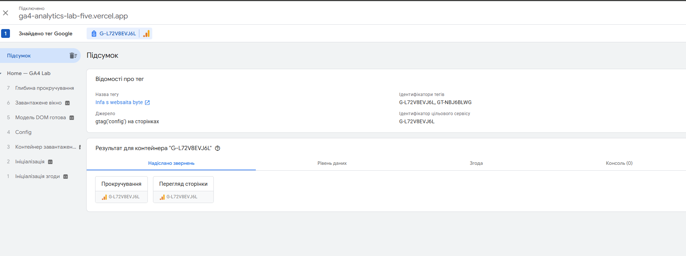
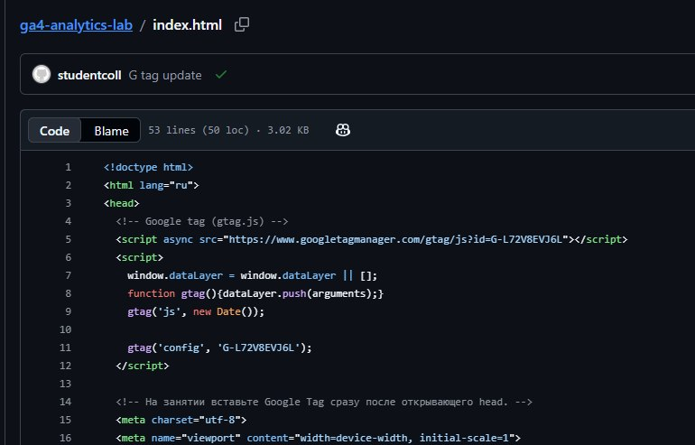
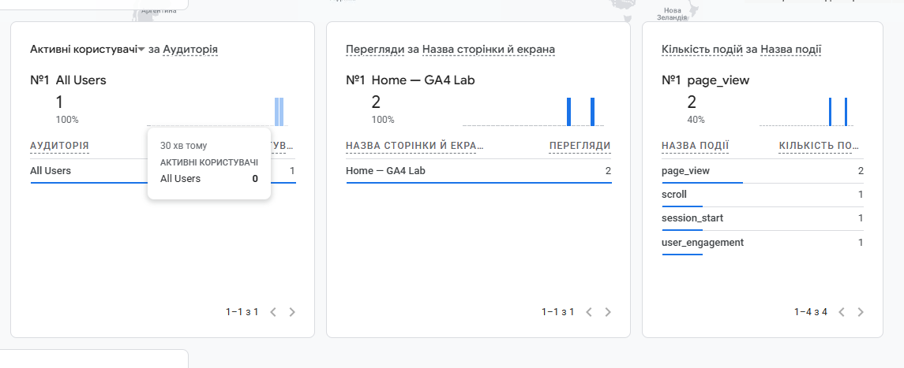
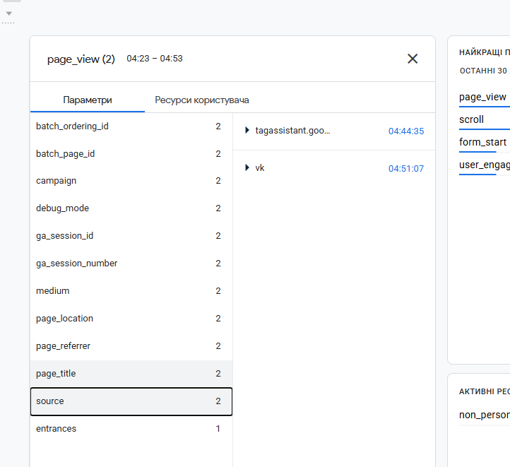
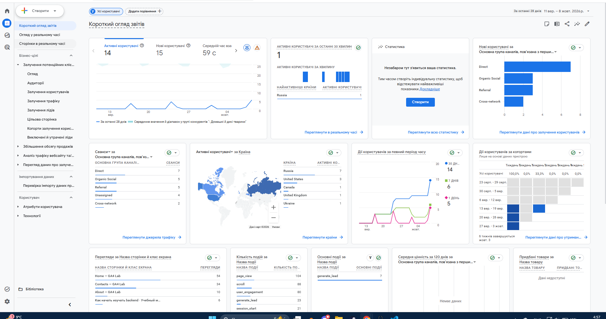

# Домашняя работа № 3 · Тег на сайте, источник и отчёты GA4

**Дисциплина:** ОП.03 «Информационные технологии»

| Поле | Значение |
|---|---|
| Фамилия, имя, отчество | Кошина Александра Олеговна |
| Группа | 9/2-ПРО-25/3 |
| Номер работы | 3 |
| Тема работы | Установка Google Tag, источник перехода и отчёты GA4 |
| Ветка | `hw-03` |

---

## 1. Мой сайт и мой ресурс

| Поле | Значение |
|---|---|
| Адрес репозитория сайта | https://github.com/alcelery/ga4-analytics-lab |
| Публичный адрес сайта | https://ga4-analytics-lab-five.vercel.app/ |
| Статус публикации | READY |
| Analytics Account | 407504102 |
| Property | 553538696 |
| Stream name | Student Analytics Website |
| Website URL в потоке | https://ga4-analytics-lab-five.vercel.app |
| Measurement ID | G-L72V8EVJ6L |
| Страницы с тегом | index.html, about.html, contacts.html |

Тег ставится на каждую страницу по одному разу: две копии дают двойные
события.

## 2. Тег установлен

**Результат проверки из инструкции тега:**





## 3. События доходят до аналитики

| Поле | Значение |
|---|---|
| Дата и время проверки | 09.10 4:37 |
| Какие страницы открывали | index.html |
| Какие события появились в Realtime | page_view, session_start |
| Число активных пользователей в момент проверки | 1 |



## 4. Источник перехода определился

Ссылка собирается с метками `utm_source`, `utm_medium`, `utm_campaign`
и открывается на своём сайте.

**Ссылка целиком:**

```
https://ga4-analytics-lab-five.vercel.app/contacts.html?utm_source=vk&utm_medium=social&utm_campaign=sept_open_2026
```

| Поле | Значение |
|---|---|
| Где в GA4 виден источник | в debug_view |
| Какое значение источника показал GA4 | vk |
| Совпадает с `utm_source` из ссылки | да |



Источник и кампания из UTM в отчёте Realtime не показываются: эти измерения
вычисляются при обработке данных. Если в Realtime источника нет, смотрите
отчёт по источникам трафика в разделе «Отчёты».

## 5. Статистика на странице «Отчёты»

| Показатель | Значение | Период |
|---|---|---|
| Пользователи | 15 | 1 день|
| Сеансы | 20 | 28 дней |
| События | 382 | 1 день |
| Самое частое событие | 104 | 1 день |



**Что видно по этим числам** (2–3 предложения):

>По этим числам видно, что за день пришло 15 пользователей, которые совершили 382 события. В среднем около 25 действий на человека, что говорит о высокой вовлечённости. При этом за 28 дней всего 20 сеансов, то есть трафик разовый и почти не повторяется. Самое частое событие сработало 104 раза за день — это примерно четверть всех событий, значит именно на нём сосредоточено основное поведение пользователей.

## 6. Что не получилось

Если какой-то шаг не заработал, напишите какой, какое сообщение показал сервис
и что было проверено по таблице из `README.md`. Незаполненный раздел означает,
что всё получилось.

> Все шло хорошо, проблем не было

## 7. Использование ИИ

Тег вы устанавливаете, проверяете и снимаете кадры сами. ИИ допускается
для формулировок и оформления.

| Вопрос | Ответ |
|---|---|
| Что сделано самостоятельно | все |
| Что спрошено у модели |  |
| Что после этого изменено |  |
