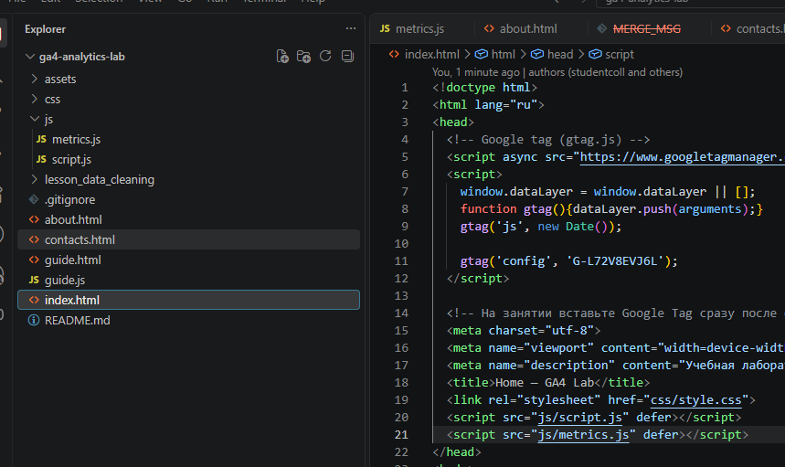
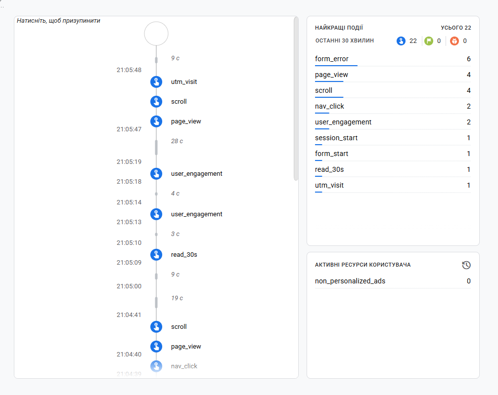
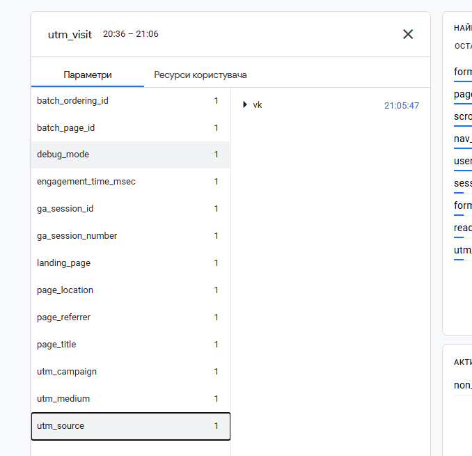
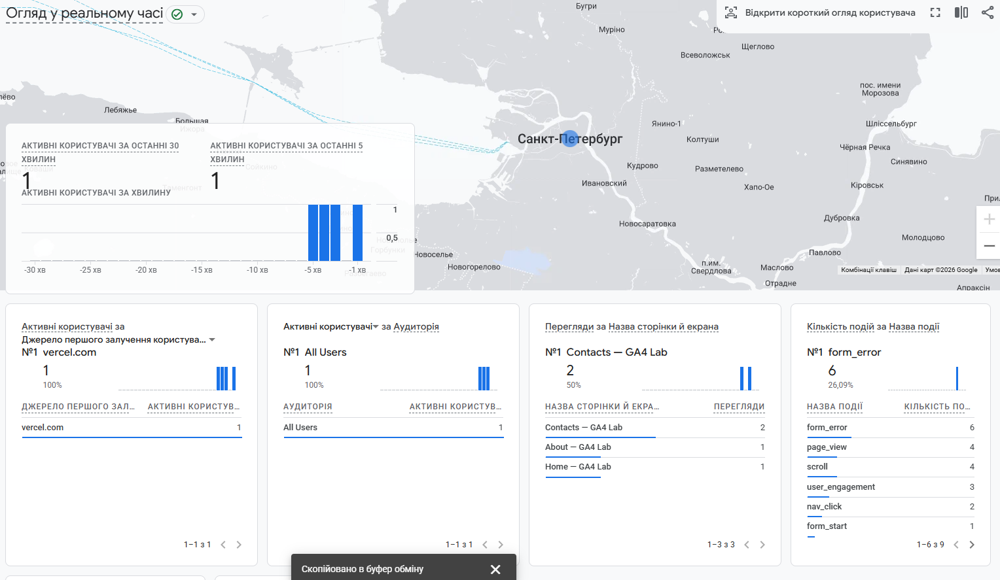

# Домашняя работа № 4 · Свои события и параметры в GA4

**Дисциплина:** ОП.03 «Информационные технологии»

| Поле | Значение |
|---|---|
| Фамилия, имя, отчество | Кошина Александра Олеговна |
| Группа | 9/2-РПО-25/3 |
| Номер работы | 4 |
| Тема работы | Свои события и параметры: четыре метрики на сайте |
| Ветка | `hw-04` |

---

## 1. Мой сайт и мой ресурс

| Поле | Значение |
|---|---|
| Публичный адрес сайта | https://ga4-analytics-lab-five.vercel.app |
| Measurement ID | G-L72V8EVJ6L |
| Коммит с метриками (ссылка или первые 7 символов) | https://github.com/alcelery/ga4-analytics-lab/commit/5c4e8c9d975156ec651955bb883a8f15a8dd0414 |
| Статус публикации | READY|
| Страницы, где подключён `js/metrics.js` | index.html, contacts.html, about.html |


## 2. Какие метрики добавлены

| Событие | Что измеряет | Что делали, чтобы оно сработало |
|---|---|---|
| `nav_click` | клики по пунктам меню | нажать на навигационнные кнопки на сайте |
| `utm_visit` | метки кампании из адреса | открыть сайт с utm меткой, подписанной какой-либо компании |
| `read_30s` | полминуты на странице | повисеть 30 секунд на сайте |
| `form_error` | форма не прошла проверку браузера | не ввести имейл парвильно |



## 3. События в DebugView

| Поле | Значение |
|---|---|
| Дата и время проверки | 09.10.2026 20:59 |
| Как подключали отладку | Tag Assistant |
| Какие из четырёх событий пришли |  |
| Какие не пришли и почему |  |



## 4. Параметры события `utm_visit`

**Ссылка, по которой открывали сайт:**

```
https://ga4-analytics-lab-five.vercel.app/contacts.html?utm_source=vk&utm_medium=social&utm_campaign=sept_open_2026
```

| Параметр | Значение в ссылке | Значение в GA4 |
|---|---|---|
| `utm_source` | vk | vk |
| `utm_medium` | social | social |
| `utm_campaign` | sept_open_2026 | sept_open_2026 |
| `landing_page` | — | /contacts.html |



Если значение в GA4 отличается от значения в ссылке, напишите, в чём разница
и почему так вышло.

> Другое значение только в landing_page, потому что его нет в самой ссылке. 

## 5. Событие вне отладки

| Поле | Значение |
|---|---|
| Где проверяли | Realtime |
| Какое событие искали | form_error |
| Сколько срабатываний показал экран | 6 (я спамила кнопку) |
| Период (для отчёта) | 1 день |



## 6. Что эти метрики показывают про сайт

Два-три предложения: что вы узнали о поведении посетителей из четырёх
новых событий. Например, по каким пунктам меню ходят чаще, доходит ли
кто-то до получаса чтения, спотыкается ли форма.

> Новые 4 события позволиляет разобрать путь пользователя. Мы можем отслеживать переход по конкретным разделам меню через nav_click и оценивать эффективность рекламных каналов по utm_visit. Чаще всего люди переходили на страницу contacts.html, а также частые ошибки в заполеннии формы. Большентсов пользователей не задердуються на страницах (кроме contacts.html) на более чем 30 секунд. 

## 7. Что не получилось

Если какая-то метрика не заработала, напишите какая, что показывал экран
и что было проверено по таблице из `README.md`. Незаполненный раздел
означает, что всё получилось.

> Все прекрасно работает у меня. Проблем с внедрением не было .

## 8. Использование ИИ

Скрипты метрик выданы готовыми. Подключение, проверку и кадры вы делаете
сами. ИИ допускается для формулировок и оформления.

| Вопрос | Ответ |
|---|---|
| Что сделано самостоятельно | все сама |
| Что спрошено у модели |  |
| Что после этого изменено |  |
