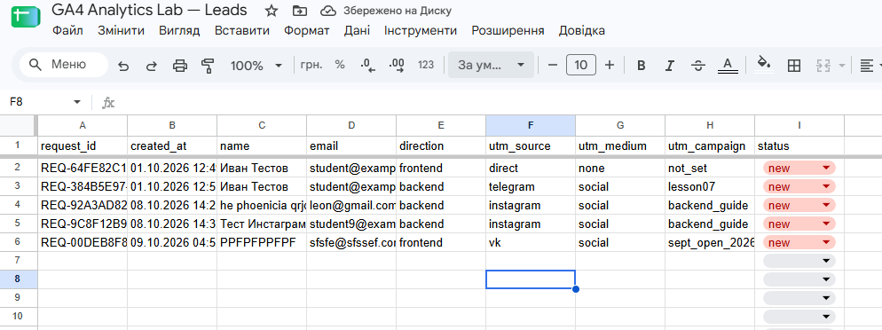
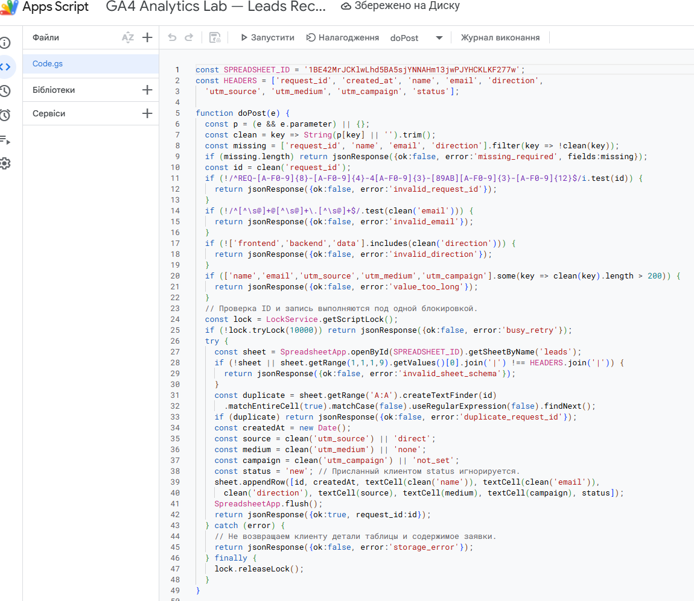
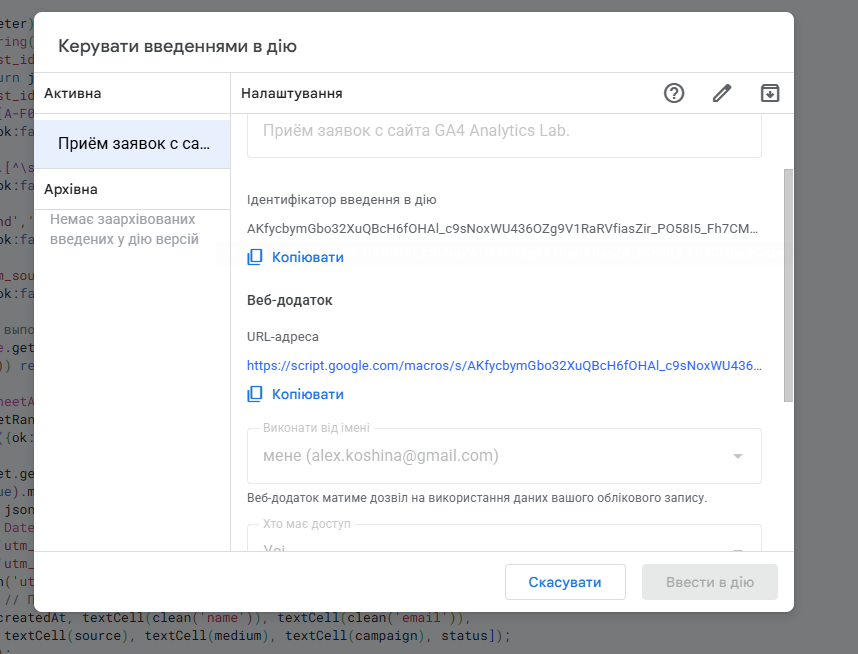
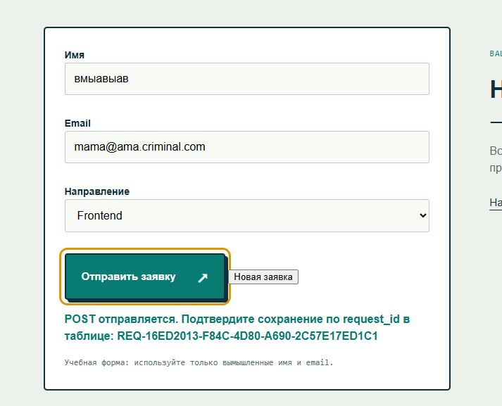
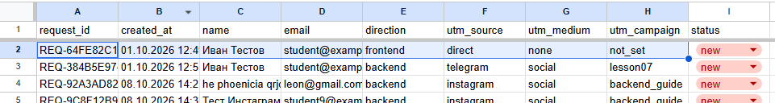
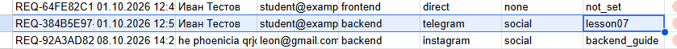
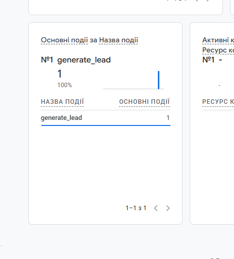
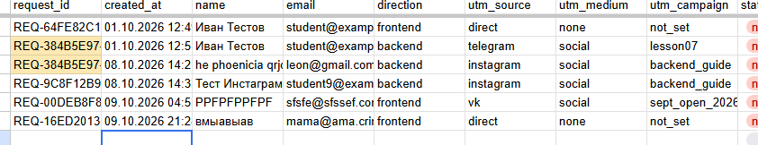
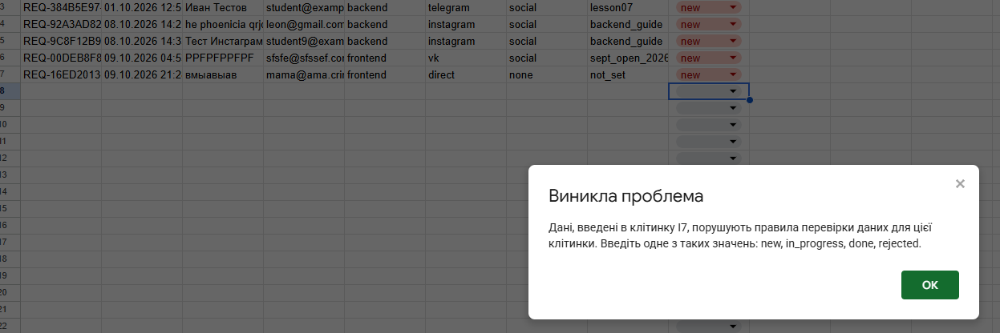

# Домашняя работа № 5 · Контролируемая таблица заявок

**Дисциплина:** ОП.03 «Информационные технологии»

| Поле | Значение |
|---|---|
| Фамилия, имя, отчество | Кошина Александра Олеговна |
| Группа | 9/2-РПО-25/3 |
| Номер работы | 5 |
| Тема работы | Форма сайта → Apps Script → Google Таблица заявок |
| Ветка | `hw-05` |

---

## 1. Таблица

Я создал таблицу «GA4 Analytics Lab — Leads» с листом `leads`. В первой
строке девять заголовков: `request_id`, `created_at`, `name`, `email`,
`direction`, `utm_source`, `utm_medium`, `utm_campaign`, `status`. Строка
заголовков закреплена, у статуса список из четырёх значений: `new`,
`in_progress`, `done`, `rejected`. Два правила подсвечивают неполную строку
и повторный `request_id`.

Ссылка на таблицу (доступ открыт только преподавателю): (https://docs.google.com/spreadsheets/d/1BE42MrJCKlwLhd5BA5sjYNNAHm13jwPJYHCKLKF277w/edit?usp=sharing)

## 2. Приёмник и форма

Я вставил `Code.gs` из материалов в Apps Script, указал ID своей таблицы
и опубликовал проект как Web app. Форму в `contacts.html` заменил
фрагментом из материалов, в `action` поставил адрес своего Web app,
обработчик формы в `js/script.js` заменил новым.

| Мои данные | Значение |
|---|---|
| Публичный адрес сайта | https://ga4-analytics-lab-five.vercel.app/ |
| Measurement ID | G-L72V8EVJ6L |
| Коммит с новой формой | https://github.com/alcelery/ga4-analytics-lab/commit/d87f7d47789b31e6ac962f5733054815c7e70fc9 |

## 3. Две тестовые заявки

Первую заявку я отправил со страницы без меток: в таблице записалось
`direct` / `none` / `not_set` и статус `new`. Вторую отправил по ссылке
с метками `telegram` / `social` / `lesson07`, и они записались в свои
столбцы.

| | Заявка без меток | Заявка с метками |
|---|---|---|
| `request_id` | REQ-64FE82C1-A084-4DAE-87BD-FA1206382C59 | REQ-384B5E97-9D67-46AB-8E3B-947A8A5D99A7 |

## 4. Событие в аналитике

После отправки в GA4 пришло событие `generate_lead`. Оно показывает
попытку отправки формы, а сама заявка подтверждается строкой в таблице.

## 5. Проверки

Форма с пустым именем не отправилась. Повторная отправка без кнопки
«Новая заявка» не добавила строку. Копия строки с тем же `request_id`
подсветилась, после кадра я её удалил. Статус `finished` таблица
не приняла, а через список статус сменился `new` → `in_progress` → `done`.

---                  

ИИ: не использовал
