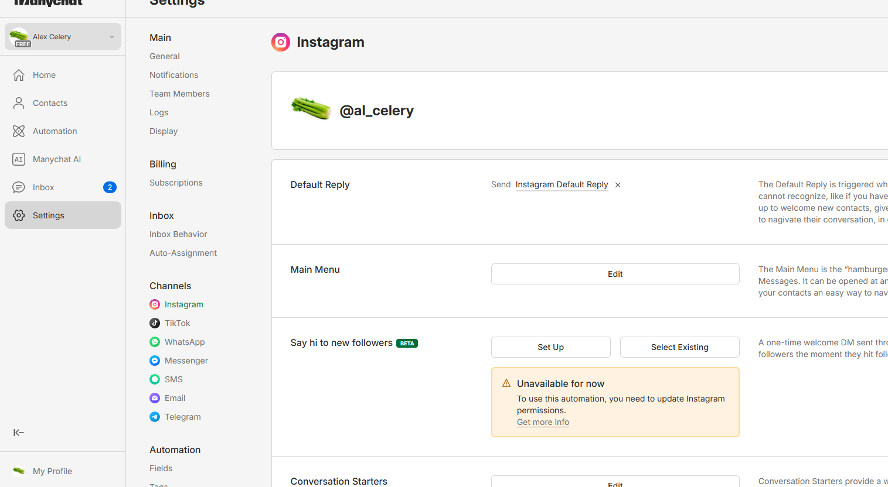
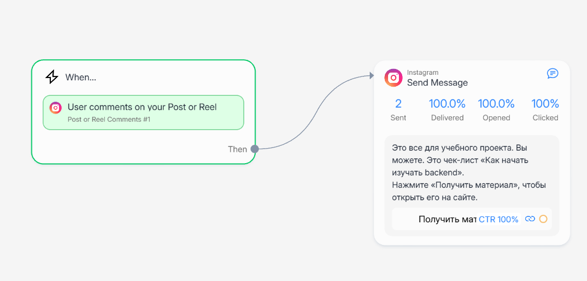
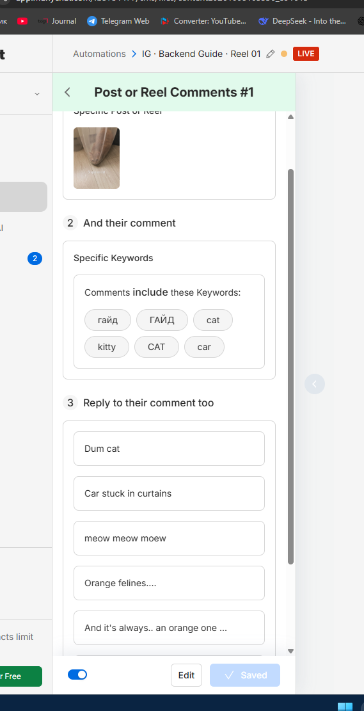
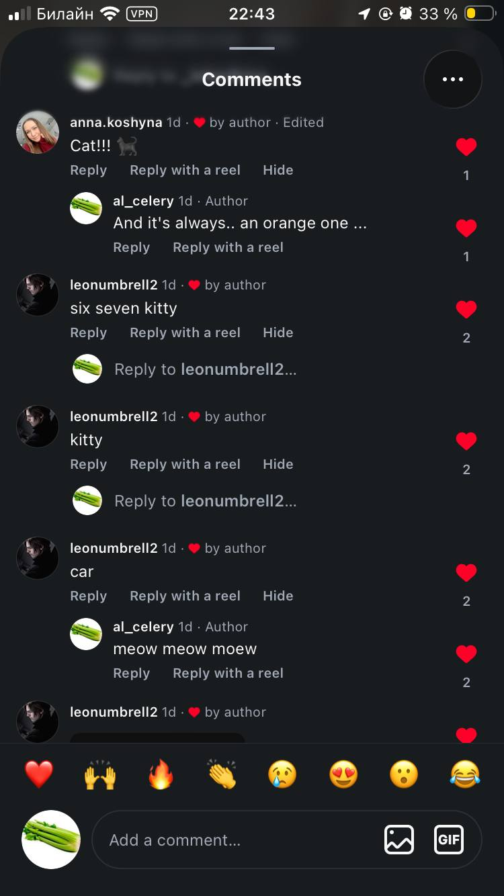
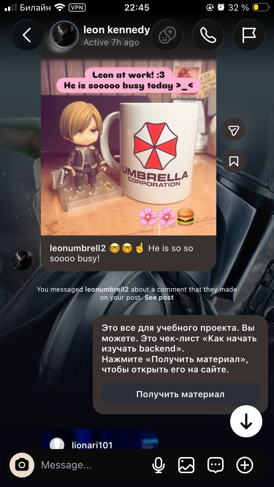
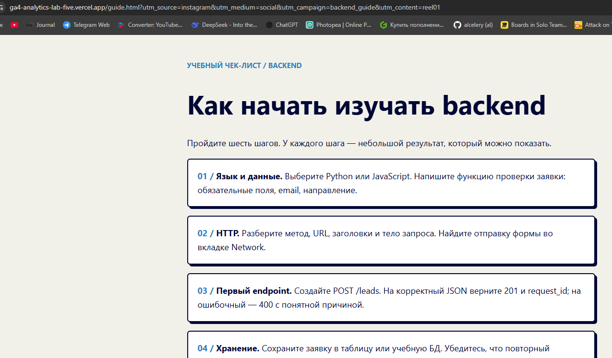
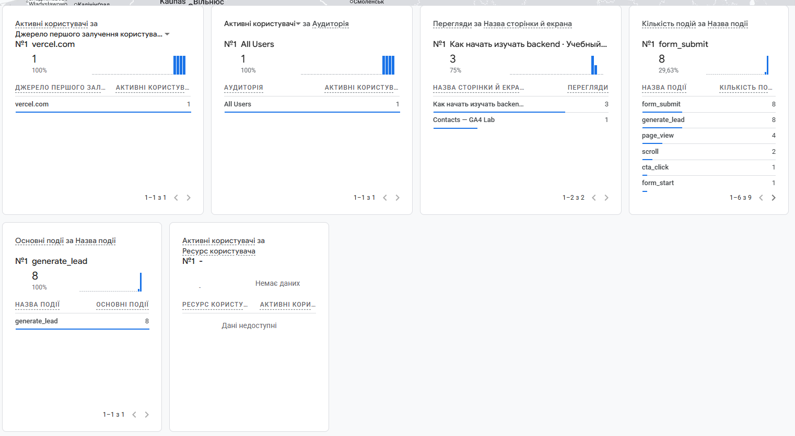
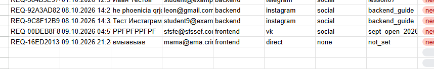

# Домашняя работа № 7 · Instagram → ManyChat → заявка

**Дисциплина:** ОП.03 «Информационные технологии»

| Поле | Значение |
|---|---|
| Фамилия, имя, отчество | Кошина Александра Олеговна |
| Группа | 9/2-ПРО-25/3 |
| Номер работы | 7 |
| Тема работы | Автоворонка из Instagram: комментарий → сообщение → сайт → заявка |
| Ветка | `hw-07` |

---

## 1. Подключение и automation

Я перевёл учебный аккаунт Instagram в профессиональный и подключил его
к ManyChat на тарифе Free. Собрал automation: триггер на комментарий под
выбранной публикацией, ключевое слово `ГАЙД`, публичный ответ, личное
сообщение и кнопка «Получить материал» со ссылкой с UTM. Automation
включена в режиме Live.

| Мои данные | Значение |
|---|---|
| Учебный аккаунт Instagram | al_celery |
| Ссылка на учебную публикацию | https://www.instagram.com/p/DeOs5JrIsuk/?vrfl=NHY2aW9vNHUyNWVu |
| Публичный адрес сайта | https://ga4-analytics-lab-five.vercel.app/ |
| Measurement ID | G-L72V8EVJ6L |

## 2. Тест цепочки

С аккаунта друга я оставил комментарий `гайд`. Под ним появился
автоматический ответ, а в Direct пришло сообщение с кнопкой. Кнопка
открыла `guide.html` с метками в адресе, оттуда я перешёл к форме
и отправил тестовую заявку.

## 3. Результат

В GA4 пришли `page_view` со страницы `guide.html` и `generate_lead`.
В листе `leads` появилась строка с метками `instagram` / `social` /
`backend_guide` и статусом `new`.

`request_id` заявки: REQ-92A3AD82-ECA5-4A93-BFBE-A58733DB4F3B

---

ИИ: не использовал 
